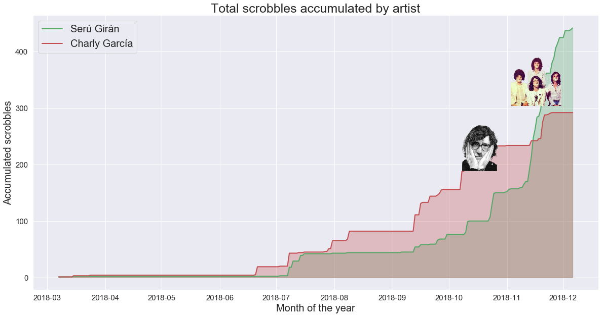
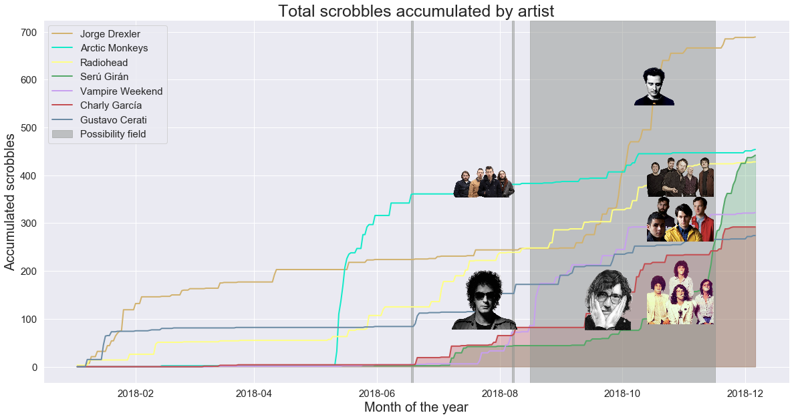

# Spotify Rewrapped
## Spotify surprises us every December with their cool end-of-the-year specials. Nevertheless, this year some of the reports smelled fishy. I decided to investigate.

### by [Alex Ingberg](https://www.linkedin.com/in/alexingberg/)

Pulling data from my Spotify and Last.fm accounts using their APIs, I did some time series analysis to check which were my real stats and see if what Spotify told me in my [Spotify Wrapped end-of-year summary](https://spotifywrapped.com/) was correct.
Spoiler alert: it wasn't.

## To check the analysis, go [here](wrapped.ipynb).

[comment]: <> (## To see the Medium article published in Towards Data Science, go [here](https://towardsdatascience.com/data-data-1fedfac91c79)) 

Some cool samples from the visualizations:

This whole project has been created using [Python 3](https://www.python.org/downloads/) and [Jupyter Notebook](http://jupyter.org/)

I created the databases with [pandas](https://pandas.pydata.org/), [Spotipy](https://spotipy.readthedocs.io/en/latest/) (an amazing Python wrapper for the Web Spotify API), and [pylast](https://github.com/pylast/pylast) (another amazing python wrapper, this time for Last.fm API).

To work on the analysis the tools I used were [pandas](https://pandas.pydata.org/), [Seaborn](https://seaborn.pydata.org/) and  [matplotlib](https://matplotlib.org/).

